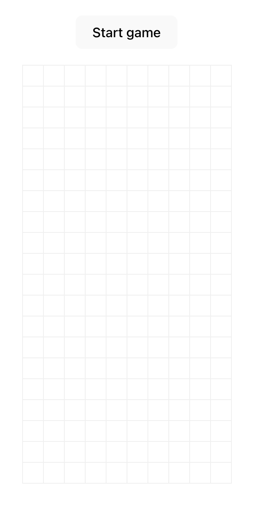
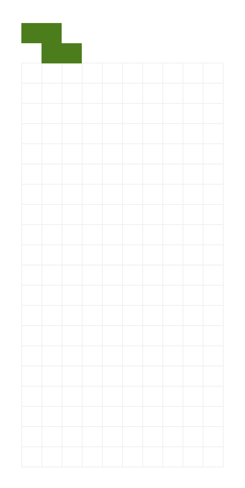
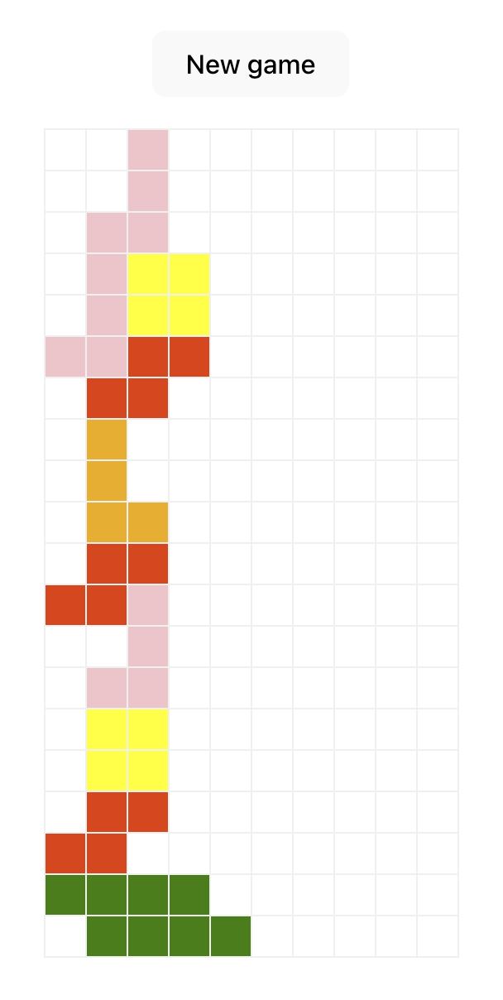

# Frontend assignment


## Instructions

1. Create a private github repository either on github.com or using the 
[Github CLI](https://cli.github.com/):

   ```
   gh repo create encord-fe-assignment
   ```

1. Write a solution to the challenge described below.

1. Once you are finished, compress your solution and send it by email to 
engineering-interviewers@encord.com. Include instructions for setting up and 
running your solution

## Problem description

### Introduction


Please build a web application to satisfy the brief specified below. Feel free 
to bring in any additional frameworks or dependencies to help in development. 
We may just ask you to explain these choices.

### The Brief

At Encord we have a highly interactive visual editor with complex state 
interactions that customers use to create annotations on their source data, 
such as images and videos. 

To demonstrate your skills in this area we would like you to create a playable
tetris game within the browser! We are looking for you to spend around 4hrs on
this so you have these constraints:

- The available shapes are the 7 standard tetronimos:

  

- There is a tetris grid of 10 columns wide and 20 rows tall with a "start game"
  button at the top:

  

- When the "start game" button is pressed a tetronimo at random is released 
  from the top left corder of the grid:

  

- Every second the piece falls one row until it can go no further as it either 
  hits the bottom of the grid or lands on top of another piece.

- When a piece has landed then it is placed in that position and all rows that
  are full are removed from the grid. This could be multiple rows.

- After any rows have been cleared (if required) then another piece is released 
  at the top of the grid like before.

- The game stops when a piece is released but cannot enter the grid. At this
  point a "new game" button appears which when clicked will clear the grid and
  start another game.

  

### Controls

Of course this is tetris so you need to be able to control it! However we only
want you to allow these specific keys:

- `leftArrow` - moves the piece to the left
- `rightArrow` - moves the piece to the right
- `downArrow` - moves the piece down one row

### Constraints

We do not want features like piece rotation, scoring, levels and so on in this 
game as we want to keep it constrained and be able to evaluate submissions 
fairly. As mentioned we want you to spend 4hrs or so on this. 


## Evaluation

We are not looking for the perfect tetris game but one that illustrates you
can build the appropriate thing for the time you have - which is an essential 
part of working at a startup.

The submission will be evaluated on a number of criteria including:

- Functionality matching the brief
- UI and UX
- Appropriate use of web technologies and standards - HTML / CSS / Browser APIs
- State management, error handling, etc
- Appproriate efficiency - this is a simple game not an algorithmic challenge

If you are successful in this challenge then you will be invited for another
complex live coding challenge.


## Final worlds

We understand this is quite a challenge but it's fairly representative in terms 
of the minimum complexity of work you'll be facing at Encord in the frontend.
However You have been asked to do this as we believe you are capable of doing 
it.

Good luck and have fun!!
