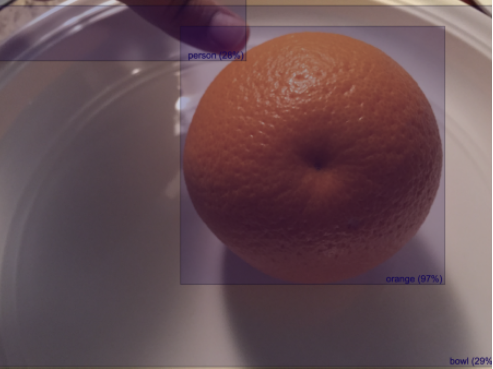

# Frontend assignment

## Instructions

1. Create a private github repository based on [this template](https://github.com/encord-team/frontend-assignment), either on github.com or using the [Github CLI](https://cli.github.com/):

   ```
   gh repo create encord-fe-assignment --clone --private --template encord-team/frontend-assignment
   ```

1. Write a solution to the challenge described below.

1. Once you are finished, compress your solution and send it by email to engineering-interviewers@encord.com.

## Problem description

### Introduction

We ask that you spend no more than 3 hours on this task, if time becomes an issue, please focus on finishing existing functionality. What we’re looking for:

- Functionality matching the brief
- Consistent code style
- Good code structure, patterns & abstraction - An intuitive and pleasant to use UI

Using either React or Next.js and Typescript, please build a React-based Single Page Application to satisfy the brief specified below. Please feel free to bring in any additional frameworks or dependencies to help in development. We may just ask you to explain these choices. Please also feel free to leave comments in the code in areas you may want to highlight if you’d want to tackle it differently if time weren’t such a consideration.
We ask you to use [json-server](https://www.npmjs.com/package/json-server) pacakge to stub out the API request this application will make using the [db.json](./assets/db.json) file. 
The application only needs to work with the provided [image](./assets/orange.jpg) and [db.json](./assets/db.json) response - no other APIs is needed.

### The Brief

The application has 2 tabs: Images & Predictions.

#### Images

This tab gives the user capability to upload into memory (no need to call an API here) and manage a list of images which will be used for further processing. The list of images should be displayed in a tabular format with the following columns:

- Filename of the Image
- Size of the image
- Time of Upload
- A button called "PREDICT".

On clicking the PREDICT button, the following should happen:

- A dialog box asking for ‘Title’ and ‘Description’ of the prediction should be displayed. The dialog box should have option to Submit and Cancel:
- On clicking submit the request to the JSON server should be made, saving the response against the image.
- On successful completion of the API request a single new entry would be added to the Predictions tab.

#### Predictions

This tab gives users the ability to view the predictions generated by this app. The list of predictions should be displayed in a tabular format with the following columns:

- Title (entered by the user in the dialog)
- Description (entered by the user in the dialog)
- Formatted timestamp of running the prediction
- Button called VIEW

On clicking the VIEW button, the following should happen:

- The image on which the prediction was run should be displayed.
- All the items in the prediction of this image should be displayed.
- A transparent rectangle covering the coordinates in the prediction item should be displayed
  over the image for all items predicted within an image, the image and prediction should be
  responsive.
- The “label” and “score” should be displayed along with the prediction for the item. Please
  refer to the image below for inspiration:

  

We wish you the best of luck and look forward to your submission. Thank you for your time!
