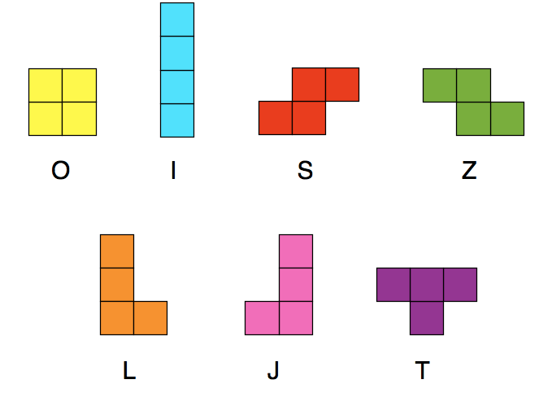

# Frontend assignment

## Instructions

1. Write a solution to the challenge described below.

1. Once you are finished, compress your solution and send it by email to 
engineering-interviewers@encord.com. Include instructions for setting up and 
running your solution

## Problem description

### Introduction

Please build a web application to satisfy the brief specified below. Feel free 
to bring in any additional frameworks or dependencies to help in development. 
We may just ask you to explain these choices.

### The Brief

At Encord we have a highly interactive visual editor with complex state 
interactions that customers use to create annotations on their source data, 
such as images and videos. 

To demonstrate your skills in this area we would like you to create a playable
tetris game within the browser! We are looking for you to spend around 4 hours on
this task, and so have placed the following constraints:

- The available shapes are the 7 standard tetronimos:

  

- The game is played on a grid of 10 columns wide and 20 rows tall.

- The user should be able to start and restart the game.

- When the game begins a random tetronimo is released from the top left corder of the grid.

- Every second the piece falls one row until it can go no further because it would move below the
  bottom of the grid or occupy the same space as another piece.

- When a piece has landed then it is placed in that position and all rows that
  are full are removed from the grid. This could be multiple rows.

- After any full rows have been cleared, another piece is released 
  at the top of the grid.

- The game stops when a piece is released but cannot enter the grid, because another 
  piece blocks it. The user should be able to start the game again.

### Controls

Of course this is tetris so the player need to be able to control their pieces! However, 
to limit the scope, we only want you to implement these specific keys:

- `leftArrow` - moves the piece to the left
- `rightArrow` - moves the piece to the right
- `downArrow` - moves the piece down one row

### Constraints

We do not want you to implement features like piece rotation, scoring, levels and so on in this 
game as we want to keep the scope constrained so that we are able to evaluate submissions 
fairly. As mentioned we want you to spend 4 hours or so on this. 

## Evaluation

We are not looking for the perfect tetris game but rather one that illustrates you
can build the appropriate thing for the time you have, which is an essential 
part of working at a startup.

Your submission will be evaluated on a number of criteria including:

- Functionality matching the brief
- UI and UX
- Appropriate use of web technologies and standards - HTML / CSS / Browser APIs
- State management, error handling, etc
- Appproriate efficiency - this is a simple game not an algorithmic challenge

If you are successful in this challenge then you will be invited for another
complex live coding challenge.

## Final words

We understand this is not a small task but it's fairly representative in terms 
of the minimum complexity of work you'll be facing at Encord in the frontend.
However, you have been asked to do this because we believe you are capable of doing 
it.

Good luck and have fun!!
